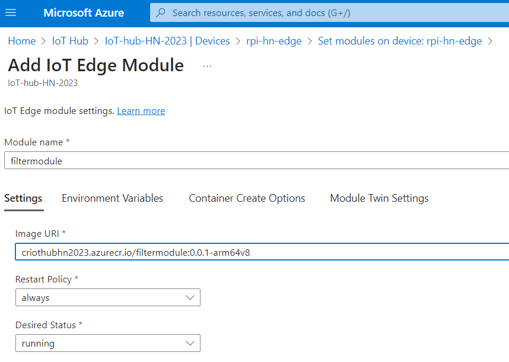

# instructions
Follow the tutorial on https://learn.microsoft.com/en-us/azure/iot-edge/tutorial-develop-for-linux?view=iotedge-1.4&tabs=c&pivots=iotedge-dev-cli,
details described below.

## Generate virtual envirionment
```console
python -m venv .\venv
```

## Activate virtual environment
```console
.\venv\Scripts\activate
```

## Install requirements in virtual environment
```console
pip install -r requirements.txt
```

## Install azure-cli and login
```console
winget install -e --id Microsoft.AzureCLI
az login
```

## Install azure-iot
```console
az extension add --name azure-iot
```

## if error urllib3.packages.six not found
```console
pip uninstall urllib3
pip install urllib3
```

## generate iotedge solution with iotedgedev
```console
iotedgedev solution init --template c
```

## update .env file
fill the keys for IoT Hub, IoT Edge device and container registry in .env file

## sign in with docker and azure CLI to the container registry
```
docker login -u <ACR username> -p <ACR password> <ACR login server>
az acr login -n <ACR registry name>
```

## build the module Docker image
```
docker build --rm -f "./modules/filtermodule/Dockerfile.arm64v8" -t <ACR login server>/filtermodule:0.0.1-arm64v8 "./modules/filtermodule"
```

## push the Docker image
```
docker push <ACR login server>/filtermodule:0.0.1-arm64v8
```

## deploy to the edge device

Deploy with the GUI or with Azure CLI.

If using the Azure CLI the deployment file needs to be adapted as described in the tutorial and place the correct image name for the filtermodule.
```
az iot edge set-modules --hub-name <my-iot-hub> --device-id <my-device> --content ./deployment.template.json
```



## check that the module is running on Raspberry Pi

```bash
pi@rpi-hn:~ $ iotedge list
NAME             STATUS           DESCRIPTION      Config
edgeAgent        running          Up 2 hours       mcr.microsoft.com/azureiotedge-agent:1.4
edgeHub          running          Up 2 hours       mcr.microsoft.com/azureiotedge-hub:1.4
filtermodule     running          Up 7 minutes     criothubhn2023.azurecr.io/filtermodule:0.0.1-arm64v8
```